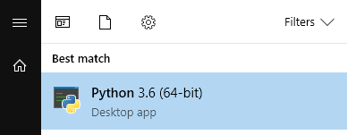
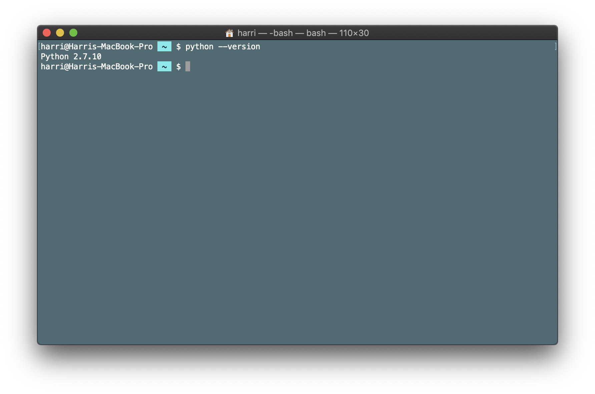

# Bevezető

Ebben a fejezetben megismerkedhetsz a Python programozási nyelv történetével, és az első lépésekkel, hogy elkezdhesd megtanulni a nyelvet. 

## A Python programozási nyelv története

A Python egy általános célú, magas szintű programozási nyelv, melyet Guido van Rossum holland programozó kezdett el fejleszteni 1989 végén, majd hozott nyilvánosságra 1991-ben. A nyelv tervezési filozófiája az olvashatóságot és a programozói munka megkönnyítését helyezi előtérbe a futási sebességgel szemben.

A Python nyelv portábilis, elérhető különféle Linux és Windows változatokra és macOS alatt is. Ingyenesen, korlátozás nélkül használható. Egyszerű szintaxis jellemzi, tömör, jól olvasható programok írhatók Pythonban. A Python folyamatosan fejlődő nyelv, ami mögött lelkes felhasználók és fejlesztők közössége áll, akiknek többsége támogatja a szabad szoftvereket.

A Python értelmező és a sokrétű, alaposan kidolgozott alap-könyvtár (Standard Library) szabadon elérhető és felhasználható akár forráskódként, akár bináris formában minden jelentősebb platformra a Python weboldalról: [https://www.python.org](https://www.python.org). Ugyanitt hivatkozások is vannak külső fejlesztésű modulokra, programokra és eszközökre, és kiegészítő dokumentációkra.

A Python dinamikus típusadású. A programozó által manipulált minden objektumnak a programvégrehajtáskor jól meghatározott típusa van, amit nem kell előre definiálni.

## Motiváció

A Python nyelv használata nagyon széleskörű. Általános programozási nyelvként könnyen tanulható és az egyik legsokoldalúbban alkalmazható programozási nyelv. Néhány fontosabb alkalmazási területe:
- általános szkriptnyelv rendszeradminisztrációs, automatizálási feladatokra
- parancssori alkalmazások fejlesztésére hatékonyan használható
- felhasználói felületek létrehozásának támogatása 
- külön területként említhető a weboldalak szisztematikus letöltése, feldolgozása, a webscraping
- webes alkalmazások fejlesztése
- adatbányászat, adattudomány, hatékony adatfeldolgozás és adatvizualizáció
- mesterséges intelligencia, neurális hálózatok definiálása és tanítása, gépi tanuló algoritmusok 
- képfeldolgozás, gépi látás
- számítógépes grafika, vizuális effektusok generálásakor a pipeline fejlesztéséhez is hatékonyan használható

A lista nem teljes, de jól látható, hogy milyen széleskörűen használható nyelv.

## Telepítés

A Python legfrissebb változata jelen dokumentum írásának idején a 3.7.3 verzió. Linux és macOS operációs rendszerek alatt valószínűleg meg alapból telepítve van egy Python verzió. Windows-hoz külön lehet letölteni és telepíteni.

A Python nyelvnek két nagy verziója van, a Python 3 és a Python 2. A Python 3 olyan újításokat tartalmaz, ami miatt visszafelé nem kompatibilis. Én ebben a irományban Python 3-at használok, és ennek a telepítését ajánlom az Olvasónak is. A Python nyelvet a 80-as évek végén fejlesztették ki, és közel 20 évvel későbbre egy nagyon elterjedt programozási nyelvvé nőtte ki magát. A korai tervezői döntések között voltak olyanok, amelyek megnehezítették a további fejlesztést. Új funkciók bevezetése a Python nyelvbe a már kialakult kódbázis alapos elemzését és átalakítását tehette szükségessé, ez viszont akadályozta a nyelv további fejlődését. A megoldást a Python 3 jelentette, amely viszont tudatosan megtörte a visszafele kompatibilitást. Ez viszont lehetőséget adott a fejlesztőknek, hogy kitakarítsák a redundáns implementációkat és újratervették a nyelvet.

A Python 3 miértjéről ebben a cikkben tájékozódhatsz (angolul): [Stop Using Python 2: What You Need To Know About Python 3](https://hackaday.com/2018/08/15/stop-using-python-2-what-you-need-to-know-about-python-3/)

### Windows

Windowshoz a Python legfrissebb változata letölthető a [Python Software Foundation](https://www.python.org/downloads/) weboldalról. Telepítés után a Start Menüből indítható a Python shell.



### Linux

Linux operációs rendszer alatt többnyire már telepítve van egy Python verzió. Az aktuális telepített Python verzió lekérdezéséhez a következő parancsot használd:

```
python --version
python3 --version
```


Amint látható, a Python 3-at külön paranccsal lehet elérni.

### macOS

macOS operációs rendszer alatt telepítve van egy Python verzió. A legfrissebb, macOS Mojave változat a Python 2.7-et tartalmazza alapból. 




A Python 3 telepítésére többfajta módszer létezik. Amit én használtam, az a HomeBrew nevű csomagkezelő használata. Ehhez először a HomeBrew-t kell telepíteni:

```
/usr/bin/ruby -e "$(curl -fsSL https://raw.githubusercontent.com/Homebrew/install/master/install)"
```

majd pedig a HomeBrew segítségével a Pythont:

```
brew install python3
```

## Python shell

A Python interpretált nyelv. Ez azt jelenti, hogy a Python nyelven írt programot megírás után az interpreter futtatja. Nincs szükség olyan fordításra (compiling), melynek során a programnyelven írt programot egy futtatható állománnyá alakítjuk, amelyet az operációs rendszer és a processzor már közvetlenül értelmezni tudna.

Python programok futtatása a Python interpreterrel lehetséges.

A Python interpreter működési módjai a következők. Ha csak elindítjuk, akkor interaktívan olvas és hajt végre utasításokat. Ha egy filenévvel, mint argumentummal hívjuk meg, akkor megpróbálja Python scriptként értelmezni és lefuttatni az adott fájlt. Használhatjuk még a `-c` parancssori opciót:

```
python -c parancs
```

melynek hatására végrehajtja a 'parancs' utasításokat. érdemes a parancs részt idézőjelbe tenni, hogy a parancsban levő szóközök ne okozzanak gondot:

```
python -c "parancs"
```

### Python programok futtatása 

A következő lehetőségek állnak rendelkezésre:

- Python program futtatása közvetlenül. A Python scripteket közvetlenül futtathatóvá kell tenni (pl. `chmod 755 myscript.py` vagy `chmod a+x myscript.py` paranccsal). Ebben az esetben a Python script első sorának a következőt kell tartalmaznia (itt feltételezem, hogy a `python` parancs elérhető a PATH-ban): `#!/usr/bin/env python`. Ez az úgynevezett "shebang".

- a Python program futtatása (pl. ```program.py```) a következő paranccsal: ```python program.py``` vagy ```python3 program.py```

- Python shell: a ```python``` vagy ```python3``` paranccsal indítható a terminal alkalmazásból (Windows operációs rendszeren PowerShell-ből)

- IPython: Interactive Python - ez egy parancsértelmező amely többfajta programozási nyelvet támogat, de eredetileg Pythonhoz fejlesztették ki. Sokfajta funkciót támogat, úgymint type introspection (változók és objektumok vizsgálata futási időben), parancsok tabulátor billentyűvel történő kiegészítése, illetve az eddig kiadott utasítások közötti visszakereshetőség (history).

- Jupyter Notebook, Jupyter Lab: webes felület, egy keretrendszer, amelyen elsősorban tudományos számításokhoz hasznos. Python scripteket lehet futtatni a webböngészőben, illetve például adatvizualizációt megjeleníteni. A Google Colab is egy ilyen keretrendszert használ.

## Csomagkezelés: ```pip```

Mi is az a ```pip```? A ```pip``` a Python standard csomagkezelője. Arra jó, hogy segítségével telepíthessünk és kezelhessünk olyan Python csomagokat, amik nem részei a Python alapkönyvtárának. Más programozási környezetből már ismerős lehet a koncepció, mint pl. JavaScript esetén az ```npm``` csomagkezelő, vagy Ruby esetében a ```gem```. 

A Python programozási nyelv Standard Könyvtára [Python Standard Library](https://docs.python.org/3/py-modindex.html) már nagyon sok alapvető csomagot tartalmaz, amelyek segítségével alkalmazások széles körét fejleszthetjük. Ugyanakkor a Python nyelvnek nagyon aktív közössége van, akik újabb és újabb csomagokat készítenek. Ezek a csomagok sok esetben a Pythonban már egy meglévő funkció vagy csomag használatát teszik egyszerűbb, például újabb interfészekkel.

Ezek a csomagok a [Python Package Index](https://pypi.org)-en kerülnek publikálásra.

Az alábbi példában telepítünk egy csomagot, a ```requests``` nevűt, amelynek a segítségével weboldalakat tudunk letölteni. Ugyanezt a funkciót a Python Standard Library csomagjaival is meg tudjuk valósítani, de a ```requests``` csomag jóval egyszerűbb, könnyebben használható interfészt nyújt. Az alábbi parancsokat egy virtuális környezeten belül futtatom, amiről a következő alfejezetben olvashatsz.

```
pip install requests
```

Ennek hatására a következőt írja ki a konzolra:

```
Collecting requests
  Downloading https://files.pythonhosted.org/packages/51/bd/23c926cd341ea6b7dd0b2a00aba99ae0f828be89d72b2190f27c11d4b7fb/requests-2.22.0-py2.py3-none-any.whl (57kB)
     |████████████████████████████████| 61kB 449kB/s 
Collecting idna<2.9,>=2.5 (from requests)
  Downloading https://files.pythonhosted.org/packages/14/2c/cd551d81dbe15200be1cf41cd03869a46fe7226e7450af7a6545bfc474c9/idna-2.8-py2.py3-none-any.whl (58kB)
     |████████████████████████████████| 61kB 632kB/s 
Collecting urllib3!=1.25.0,!=1.25.1,<1.26,>=1.21.1 (from requests)
  Downloading https://files.pythonhosted.org/packages/39/ec/d93dfc69617a028915df914339ef66936ea976ef24fa62940fd86ba0326e/urllib3-1.25.2-py2.py3-none-any.whl (150kB)
     |████████████████████████████████| 153kB 552kB/s 
Collecting chardet<3.1.0,>=3.0.2 (from requests)
  Downloading https://files.pythonhosted.org/packages/bc/a9/01ffebfb562e4274b6487b4bb1ddec7ca55ec7510b22e4c51f14098443b8/chardet-3.0.4-py2.py3-none-any.whl (133kB)
     |████████████████████████████████| 143kB 779kB/s 
Collecting certifi>=2017.4.17 (from requests)
  Downloading https://files.pythonhosted.org/packages/60/75/f692a584e85b7eaba0e03827b3d51f45f571c2e793dd731e598828d380aa/certifi-2019.3.9-py2.py3-none-any.whl (158kB)
     |████████████████████████████████| 163kB 859kB/s 
Installing collected packages: idna, urllib3, chardet, certifi, requests
Successfully installed certifi-2019.3.9 chardet-3.0.4 idna-2.8 requests-2.22.0 urllib3-1.25.2
```

Ezután, ha lekérdezzük a telepített csomagok listáját ezzel a paranccsal:

```
pip list
```

akkor a következőt kapjuk:

```
Package       Version 
------------- --------
certifi       2019.3.9
chardet       3.0.4   
idna          2.8     
pip           19.1.1  
pkg-resources 0.0.0   
requests      2.22.0  
setuptools    41.0.1  
urllib3       1.25.2  
wheel         0.33.4 
```

A ```pip``` mindig a legfrissebb verziót telepíti az adott csomagból, és azokat a további függőségeket is telepíti, amik a csomaghoz szükségesek. Egy adott csomagról a következő paranccsal lehet információt lekérdezni:

```
pip show requests
```

Eredmény:

```
Name: requests
Version: 2.22.0
Summary: Python HTTP for Humans.
Home-page: http://python-requests.org
Author: Kenneth Reitz
Author-email: me@kennethreitz.org
License: Apache 2.0
Location: /home/harri/Programming/MyNewPythonVenv/lib/python3.7/site-packages
Requires: certifi, urllib3, idna, chardet
Required-by:
```

## Virtuális környezet: ```virtualenv```

A ```virtualenv``` egy Python csomag, amivel virtuális környezetet lehet létrehozni a Python projektünk számára. Tulajdonképpen létrehoz egy külön könyvtárat a Python projektünkhöz, és ez a könyvtár az összes külső függőséget (külső könyvtárakat, amiket a projektünk használ) tartalmazni fogja. 

A ```virtualenv``` telepítése ```pip``` segítségével:

```
pip install virtualenv
```

Majd a telepítés eredményének ellenőrzése a ```virtualenv``` verziójának lekérdezésével:

```
virtualenv --version
```

### Virtuális környezet létrehozása

Ehhez létre kell hoznunk egy új könyvtárat a projektünk számára, majd ezt a könyvtárat kijelölni a virtuális környezet számára.

```
mkdir MyNewPythonProjectVenv
virtualenv -p python3 MyNewPythonProjectVenv
```

Ezek után a ```MyNewPythonProjectVenv/bin``` könyvtár tartalmazni fogja a Python 3 fordítót. Ahhoz, hogy ezt a virtuális környezetet használni tudjuk, vagyis ezen a virtuális környezeten belül kezdjünk el dolgozni, a következő parancsot kell kiadni:

```
source MyNewPythonProjectVenv/bin/activate
```

Innentől kezdve, ha telepítünk egy csomagot a ```pip```-pel, akkor az ebben a virtuális környezetben fog települni. Például a ```numpy``` csomag telepítése (a ```numpy```-ról bővebben egy későbbi fejezetben lesz szó):

```
pip install --upgrade numpy
```

### Jelenleg telepített Python csomagok listája

Ha szeretnénk később ugyanezt a virtuális környezetet létrehozni, ugyanezekkel a telepített csomagokkal, például egy másik gépen, akkor szükségünk van arra a listára, hogy milyen csomagjaink lettek telepítve. Erre szolgál a következő parancs (a virtuális környezetből kell kiadni):

```
pip freeze > requirements.txt
```

Ez létrehozza a ```requirements.txt``` filet, ami tartalmazni fogja a csomagok listáját. Innentől kezdve ha telepíteni szeretnénk ezeket a csomagokat, azt megtehetjük ezzel a paranccsal:

```
pip install -r requirements.txt
```

### Kilépés a virtuális környezetből

Amennyiben a fentebb említett  ```activate``` paranccsal aktiváltuk a virtuális környezetet, akkor a 

```
deactivate
```

paranccsal kiléphetünk belőle.

### A `--system-site-packages` parancssori opció

Ha a virtuális környezetünket a `--system-site-packages` parancssori opcióval hozzuk létre, akkor a környezet örökölni fogja a csomagokat a globális `site-packages` könyvtárból (tehát abból a könyvtárból, ami a rendszeren futó default Python-hoz tartozik). Tehát például a már meglévő, globálisan telepített csomagokat fogjuk tudni használni a virtuális környezetből, ezeket nem kell külön telepíteni a virtuális környezetünkben. 

## Python program futtatása online

Python kód online futtatására is van lehetőség, például az alábbiak:
- [Repl.it](https://repl.it) - én ezt tartom a legjobbnak egyszerű Python programok futtatására
- [Google Colab](https://colab.research.google.com/) - ez leginkább tudományos számításokhoz, gépi tanulás témakörében használható jól. Beépített GPU támogatással nagy számítási igényű modelleket is lehet tanítani vele.
- [Tutorialspoint online Python](https://www.tutorialspoint.com/execute_python_online.php)

## Kódszerkesztők, Integrált Fejlesztői Környezetek (IDE-k)

Az általam használt kódszerkesztő a [Visual Studio Code](https://code.visualstudio.com/). Egyéb kódszerkesztők és Integrált Fejlesztői Környezetek:
- [Atom editor](https://atom.io)
- [PyCharm](https://www.jetbrains.com/pycharm/)
- [IDLE](https://docs.python.org/3/library/idle.html)

# Befejezés

Ebbe a fejezetbe ennyi fért bele. A következő részben ismertetem a Python alap szintaxisát.
