<p align="right"><sup><a href="README.md">Tartalom</a></sup></p>

# Egyszerű neurális hálózatok építése Pythonban

Ebben a cikkben egyszerű neurális hálózatokat építek Python nyelven. A feladathoz kizárólag a következő Python könyvtárakat használom: `numpy`, `tqdm`.

A `numpy` csomag a tudományos számításokhoz használatos csomag a Pythonban. A `tqdm` pedig egy progress bar megjelenítő segéd csomag.

Az itt bemutatott neurális hálózatok egyszerű kétváltozós logikai függvényeket modelleznek. Kitérek arra, hogy 1 db neuronnal milyen logikai függvényeket lehet megvalósítani.

# Bevezető

Jelen cikknek nem célja, hogy általános alapfogalmakkal ismertesse meg az olvasót a mesterséges intelligenciával, gépi tanulással, neurális hálózatokkal, mély tanulással kapcsolatban. A referenciákban felsorolt és egyéb szakirodalmakban alaposan lehet tájékozódni ezekkel a témákkal kapcsolatban.

A cikkben implementált neurális hálózatok logikai függvényeket valósítanak meg, az `ÉS` illetve `VAGY` függvényt, valamint a kizáró vagy, `XOR` függvényt. Látni fogjuk, hogy egyetlen neuronnal mit lehet megvalósítani, és mi az, amihez már több neuronból álló hálózat szükséges.

A cikk tartalmának értelmezéséhez a következő alapfogalmak ismerete szükséges, ezekkel csak érintőlegesen foglalkozom ebben a cikkben:

- neurális hálózat
- tanítási fázis
- előreterjesztés (feed forward)
- hiba-visszaterjesztés (backpropagation)
- gradiensereszkedés (gradient descent)
- aktivációs függvény (activation function)
- szigmoid függvény / logisztikai függvény (sigmoid function / logistic function)
- súlyok (weights)
- predikció (prediction)
- hipotézis függvény (hypothesis function)
- tanulási ráta (learning rate)
- vektor (vector)
- mátrix (matrix)
- alapvető lineáris algebrai ismeretek

# Egyetlen neuron 

Az általam használt egyszerű mesterséges neuron modellje az alábbi ábrán látható. Három bemeneti változója van, de igazából csak kettő az, ami a valós bemenő adatokat tartalmazza, az x0 változó mindig 1-es értéket tartalmaz. A neuron által adott predikció a bemenő értékek, és a súlyok szorzata, ami egy lineáris függvényt ad, majd ennek eredményére a szigmoid függvény van alkalmazva, mint aktivációs függvény.

Az alábbi ábrán egyszeres aláhúzás jelöli a vektor típusú változókat (sorvektorokat és oszlopvektorokat).


A bemeneti adatokat `x`-szel jelölöm:

")

A súlyokat, jelen esetben egy vektort, `w` jelöli.

")

A hipotézis függvény `h`, vagyis ami a neurális hálózat kimenet egy adott `x` bemenetre, `w` súlyok mellett:

 = g(wx) = g(x0w0+x1w1+x2w2)")

A szigmoid függvény, `g`:

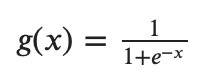

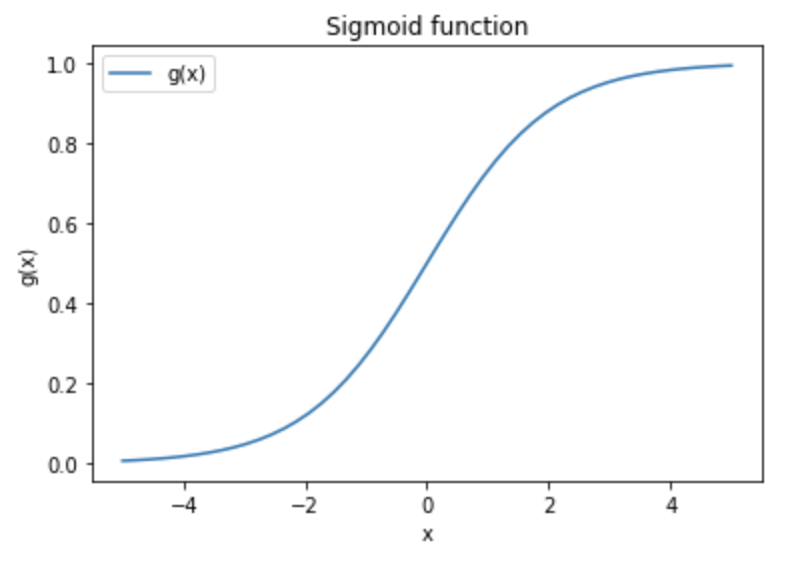

Ha például a logikai `ÉS` műveletet szeretnénk megvalósítani, akkor intuitív módon felírhatunk egy olyan súlyvektort, amivel a neurális hálózat, ami jelen esetben csak egyetlen neuronból áll, kb. az `ÉS` műveletnek megfelelő eredményt ad a kimenetén. Hasonlóan járhatunk el más logikai műveletekkel is. Az alábbi ábrán a logikai `ÉS` és `VAGY` művelet egy neuronnal történő megvalósításához tartozó súlyokat láthatjuk. Érdemes észrevenni, hogy ha megfordítom a súlyok előjelét, akkor a végeredmény negáltját kapom, tehát így megvan további két függvény implementációja.

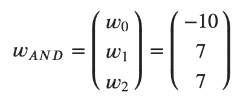

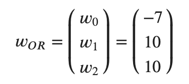

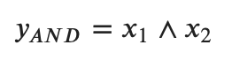

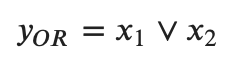

Az `ÉS` és a `VAGY` függvény igazságtáblája, és a neurális hálózat kimenete, ha az előbbi súlyokat használjuk:

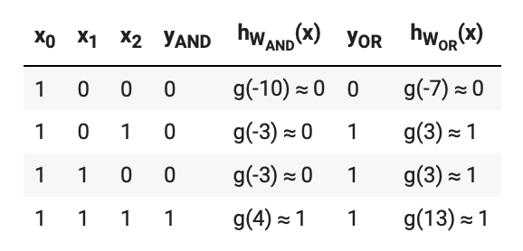

# Egyszerű neuron implementációja

Az alábbi példaprogram egyetlen neuron tanítását valósítja meg. A gradiensereszkedést (gradient descent) használom, de a hibafüggvény parciális deriválása helyett egy közelítést alkalmazok a jól ismert módszerrel.

1. *inicializálás*: véletlenszerű kezdő súly értékek beállítása

2. *előreterjesztés (feed forward)*: kiszámolom a neuron kimeneteit minden egyes bemenetre.


")

3. *hiba-visszaterjesztés (backpropagation)*: A hibafüggvény (amit J jelöl) aktuális értéke az aktuális súlyoktól függ. Ha az i. súlyt kicsit változtatom (egy kis számot hozzáadok, illetve egy kis számot kivonok belőle), ki tudom számolni, hogy mennyit változik a hibafüggvény értéke, ha a többi súlyt változatlanul hagyom. Ebből ki tudom számolni, hogy megközelítőleg mekkora a hibafüggvény meredeksége az. i. súly mentén, ha a többi súly változatlanul marad. Tehát tulajdonképpen a hibafüggvény parciális deriváltját számítom ki megközelítőleg. Ezekből a parciális deriváltakból összeállítok egy oszlopvektort. Az oszlopvektor sorainak száma megegyezik a súlyok számával, vagyis a bemenő változók számával (jelen esetben 3). A kiszámolt vektort megszorzom a tanulási rátával, és kivonom a súlyvektor jelenlegi értékéből. Ezzel megkapom az új súlyvektort.

Ezt a három lépést kell ismételni kellően sokszor ahhoz, hogy jó közelítéssel megtaláljuk a hibafüggvény minimumhelyét, tehát azokat a súlyokat, ahol a hibafüggvény a legkisebb.

A hibafüggvény, `J` (`y` jelöli a tényleges eredményt, `h` pedig a hipotézist):

")

A súlyvektor, ha az i. súlyt kicsit változtatom, és a többi súly változatlanul marad:

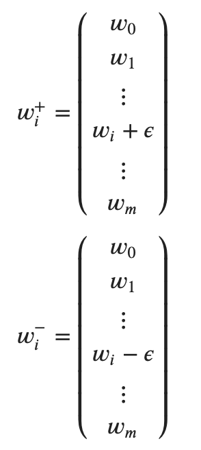

A hibafüggvény változásaiból összeállított vektor i. eleme, és maga a vektor:

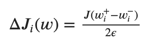

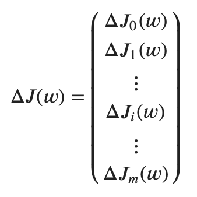

Ez alapján az új súlyvektor:

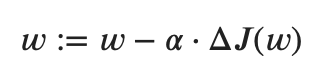

A konstans értékek a következők:

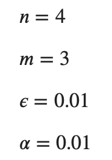

A súlyokat minden iterációnál frissítem, így lépésről lépésre eljutok a hibafüggvény minimum értékének közelébe. Az alábbi példaprogram a logikai `ÉS` műveletet valósítja meg, 100.000 iterációval.

```python
#!/usr/bin/env python

import numpy as np
from tqdm import tqdm

# we have only one neuron
NEURONS = 1 

# learning rate
LEARNING_RATE = 0.01

# number of iterations
NUM_OF_ITERS = 100000

# small difference to be able to approximately calculcate derivative
EPSILON = 0.01


class TwoVariablesBooleanFunctionNeuralNetwork:
    def __init__(self, x, y):
        #  - n rows: the number of samples
        self.n = x.shape[0]

        #  - m columns: the number of input variables
        self.m = x.shape[1]

        # x is a np.array which is a n x m matrix. It has:
        #  - n rows: the number of samples
        #  - m columns: the number of input variables
        self.input = x 
        
        # np.shape returns a tuple: (n,m)
        # W is a matrix of m x l:
        #  - m rows: the number of input variables
        #  - l columns: the number of neurons
        self.W = np.random.rand(self.m, NEURONS)

        # y and output are column vectors of size n
        self.y      = y
        self.output = np.zeros(self.y.shape)


    def feedforward(self):
        self.output = sigmoid(np.dot(self.input, self.W))


    def J(self, W):
        # here the np.dot multiplication will give back
        # a column vector, which we reshape (so that it will
        # be transposed to a row vector), and then squeeze (to
        # get rid of the extra dimension)
        g_xw = np.array(sigmoid(np.dot(self.input, W))).reshape(1,-1).squeeze()

        # calculate the difference between our hypothesis and 
        # the desired values
        err_diff = self.y - g_xw

        # return the error as sum of squared difference
        return (1 / self.n) * np.sum(np.square(err_diff))


    def W_i_plus(self, i):
        W_copy = self.W.copy()
        W_copy[i][0] = W_copy[i][0] + EPSILON
        return W_copy


    def W_i_minus(self, i):
        W_copy = self.W.copy()
        W_copy[i][0] = W_copy[i][0] - EPSILON
        return W_copy


    def delta_J_i(self, i):
        return (
            (self.J(self.W_i_plus(i)) - self.J(self.W_i_minus(i))) / (2*EPSILON)
        )


    def backprop(self):
        delta_J = []

        for i in range(0,self.m):
            delta_J += [self.delta_J_i(i)]

        delta_J = np.array(delta_J).reshape(-1,1)

        self.W -= LEARNING_RATE * delta_J


def sigmoid(x):
    return 1/(1+np.exp(-x))


if __name__ == "__main__":
    x = np.array([[1,0,0],
                  [1,0,1],
                  [1,1,0],
                  [1,1,1]])

    y = np.array([0,0,0,1])

    nn = TwoVariablesBooleanFunctionNeuralNetwork(x,y)
    
    pbar = tqdm(total = NUM_OF_ITERS)

    for i in range(0, NUM_OF_ITERS):
        nn.feedforward()
        nn.backprop()
        pbar.update(1)

    print("Number of iterations: {}".format(NUM_OF_ITERS))
    print("Weights (W0, W1, ... Wm):\n{}".format(nn.W))
    print("Output (h_W(x)_0, h_W(x)_1, ... h_W(x)_n):\n{}".format(nn.output))
```

A 100.000. iteráció után a futtatás eredménye a következő:

```
Number of iterations: 100000
Weights (W0, W1, ... Wm):
[[-7.05683897]
 [ 4.63961056]
 [ 4.63961068]]
Output (h_W(x)_0, h_W(x)_1, ... h_W(x)_n):
[[8.60771325e-04]
 [8.18688101e-02]
 [8.18688009e-02]
 [9.02240966e-01]]
```

Amint látható, az algoritmus által számolt súlyok nem állnak messze azoktól, amiket intuitívan felírtunk az előbb.

# Mire alkalmas egyetlen neuron?

Ha kétváltozós logikai függvényeket tekintjük, könnyen beláthatjuk, hogy összesen 16 ilyen függvényt lehet leírni (2 * 2 * 2 * 2 = 16). Ezek közül láttunk kettőt, amire működik az általunk implementált tanítási algoritmus. Ha kipróbáljuk, hogy a kizáró vagy, a `XOR` műveletre be tudja-e tanítani az algoritmusunk a neuront, látni fogjuk, hogy ez nem működik. Ehhez meg kell változtatni az y értékét a következő módon:

```python
y = np.array([0,1,1,0])
```

Majd így kell lefuttatni a programot. A kimenet a következő lesz:

```
Number of iterations: 100000
Weights (W0, W1, ... Wm):
[[-1.84525106e-09]
 [ 1.55567381e-09]
 [ 1.55567959e-09]]
Output (h_W(x)_0, h_W(x)_1, ... h_W(x)_n):
[[0.5]
 [0.5]
 [0.5]
 [0.5]]
```

Tehát a program ugyan kiszámolta a súlyértékeket, de a kimenet minden esetben 0.5, amit a szigmoid függvény 0-nál vesz fel. Ez így nem jó, ez a neuron nem képes visszaadni a XOR művelet eredményét. Ennek az az oka, hogy a `XOR` művelet nem monoton művelet.

A kétváltozós logikai függvényeket az alábbi táblázat írja le, jelöltem, hogy melyik függvény monoton, és melyik nem.

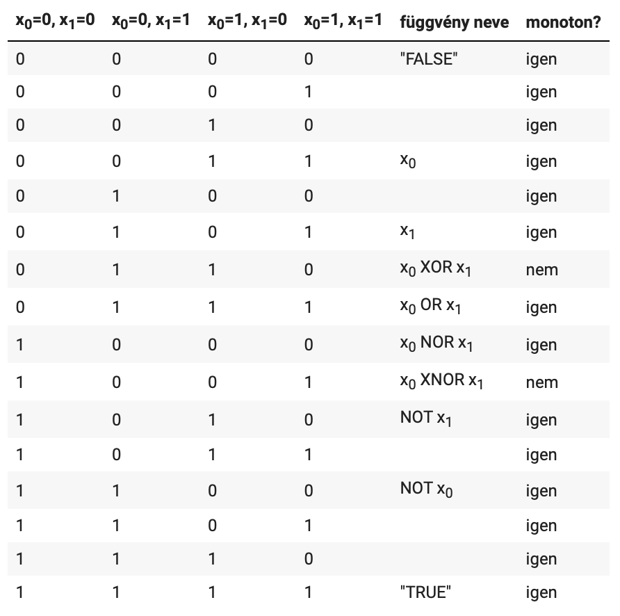

Ahogy Bernd Steinbach és Roman Kohut publikációjából kiderül, egyetlen neuron ilyen módon történő kialakításával a monoton függvényeket lehet leírni. Már a legegyszerűbb nem-monoton logikai függvény leírása sem lehetséges egyetlen ilyen neuronnal.

# Több neuronból álló hálózat

A megoldást több neuron alkalmazása jelenti. Na de mennyi neuron, és milyen elrendezésben? Az alábbi példában egy olyan hálózatot mutatok be, ami a `XOR` függvényt valósítja meg.

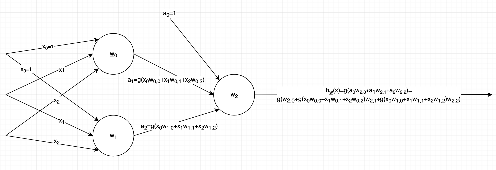

Tulajdonképpen a `XOR` függvényt össze lehet rakni a következő módon, monoton függvények segítségével:

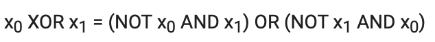

Tehát a fenti neurális hálózatban:

- a 0. számú neuron (aminek `W0` a súlyvektora) a `NOT x0 AND x1` függvényt,

- az 1. számú neuron (aminek `W1` a súlyvektora) a `NOT x1 AND x0` függvényt,

- az 2. számú neuron (aminek `W2` a súlyvektora) az `a1 OR a2` függvényt

valósíthatja meg. Ez egy megvalósítás, de látni fogjuk, hogy más megvalósítás is létezik.
Ebben a hálózatban a predikció kiszámítása összetettebb.

# Több neuronból álló hálózat tanítása

Az alábbi programban a fent ábrázolt, 3 neuronból álló hálózat tanítását implementáltam. A hálózat a `XOR` függvényt valósítja meg. A lépések ugyanazok, mint az előző hálózatnál, csak a kalkuláció bonyolultabb. A backpropagation lépésnél is ugyanazt a módszert alkalmaztam.

```python
#!/usr/bin/env python

import numpy as np
from tqdm import tqdm

# we have 3 neurons
NEURONS = 3 

# learning rate
LEARNING_RATE = 0.01

# number of iterations
NUM_OF_ITERS = 1000000

# small difference to be able to approximately calculcate derivative
EPSILON = 0.01


class TwoVariablesBooleanFunctionNeuralNetwork:
    def __init__(self, x, y):
        #  - n rows: the number of samples
        self.n = x.shape[0]

        #  - m columns: the number of input variables
        self.m = x.shape[1]

        # x is a np.array which is a n x m matrix. It has:
        #  - n rows: the number of samples
        #  - m columns: the number of input variables
        self.input = x 
        
        # np.shape returns a tuple: (n,m)
        # W is a matrix of m x l:
        #  - m rows: the number of input variables
        #  - l columns: the number of neurons
        # Hints:
        #  - self.W.T[0] # this means the first column of the matrix   
        #  - self.W[0]   # this means the first row of the matrix   
        #  - self.W.T    # this is the transpose of self.W
        self.W = np.random.rand(self.m, NEURONS)

        # y and output are column vectors of size n
        self.y      = y
        self.output = np.zeros(self.y.shape)


    def feedforward(self):
        self.output = self.feedforward_with_W(self.W)


    def feedforward_with_W(self, W_current):
        a1 = sigmoid(np.dot(self.input, W_current.T[0]))
        a2 = sigmoid(np.dot(self.input, W_current.T[1]))
        a = np.array([np.ones(self.n), a1, a2]).T  
        return sigmoid(np.dot(a, W_current.T[2]))


    def J(self, W):
        # here the np.dot multiplication will give back
        # a column vector, which we reshape (so that it will
        # be transposed to a row vector), and then squeeze (to
        # get rid of the extra dimension)
        output_current = self.feedforward_with_W(W)

        #g_xw = np.array(sigmoid(np.dot(self.input, W))).reshape(1,-1).squeeze()

        # calculate the difference between our hypothesis and 
        # the desired values
        err_diff = self.y - output_current

        # return the error as sum of squared difference
        return (1 / self.n) * np.sum(np.square(err_diff))


    def W_i_j_plus(self, i, j):
        W_copy = self.W.copy()
        W_copy[i][j] = W_copy[i][j] + EPSILON
        return W_copy


    def W_i_j_minus(self, i, j):
        W_copy = self.W.copy()
        W_copy[i][j] = W_copy[i][j] - EPSILON
        return W_copy


    def delta_J_i_j(self, i, j):
        return (
            (self.J(self.W_i_j_plus(i,j)) - self.J(self.W_i_j_minus(i,j))) / (2*EPSILON)
        )


    def backprop(self):
        delta_J = []

        for i in range(0, self.m):
            for j in range(0, NEURONS):
                delta_J += [self.delta_J_i_j(i,j)]

        delta_J = np.array(delta_J).reshape(self.m,NEURONS)

        self.W -= LEARNING_RATE * delta_J


def sigmoid(x):
    return 1/(1+np.exp(-x))


if __name__ == "__main__":
    x = np.array([[1,0,0],
                  [1,0,1],
                  [1,1,0],
                  [1,1,1]])

    y = np.array([0,1,1,0])

    nn = TwoVariablesBooleanFunctionNeuralNetwork(x,y)
    
    pbar = tqdm(total = NUM_OF_ITERS)

    for i in range(0, NUM_OF_ITERS):
        nn.feedforward()
        nn.backprop()
        pbar.update(1)

    print("Number of iterations: {}".format(NUM_OF_ITERS))
    print("Weights (W0, W1, ... Wm):\n{}".format(nn.W))
    print("Output (h_W(x)_0, h_W(x)_1, ... h_W(x)_n):\n{}".format(nn.output))
```

Most 1.000.000 iterációt futtatok. A 3 neuronból álló hálózatunk tanítása már látványosan lassabb, mint az előbbi, egyetlen neuron tanítása.

```
1853.17it/s]Number of iterations: 1000000
Weights (W0, W1, ... Wm):
[[ -7.04256823  -2.86741693  -4.42544641]
 [  4.587206     6.4488553  -10.25340688]
 [  4.59143431   6.46611348   9.56319587]]
Output (h_W(x)_0, h_W(x)_1, ... h_W(x)_n):
[0.01945483 0.98319957 0.98318054 0.0174142 ]
```

Látható, hogy a hálózat nem úgy valósítja meg a függvényt, mint fent az intuitív példában írtam. Ha a súlymátrixot megnézzük, láthatjuk, hogy az első oszlop, ami a `w0` súlyokat jelenti, az `ÉS` függvényt valósítja meg. A második oszlop (`w1`) a `VAGY` függvénynek felel meg. A harmadik súly-oszlop pedig a következő függvénynek felel meg:


Tehát a neurális hálózatunk a következő függvényt valósítja meg:

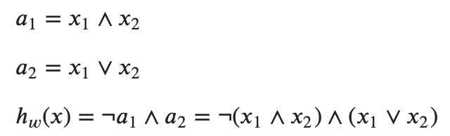

Ha végiggondoljuk, ez valóban a `XOR` függvény. Tehát ezt találta meg a 3 neuronból álló hálózatunk.

# Referenciák

Bernd Steinbach, Roman Kohut - Neural Networks - A Model of Boolean Functions: https://pdfs.semanticscholar.org/74f4/e337add835e4122cdc62179653b6bcf776b0.pdf

Martin Anthony - Boolean Functions and Artificial Neural Networks: http://www.cdam.lse.ac.uk/Reports/Files/cdam-2003-01.pdf

Neural Networks: What can a network represent - http://www.cs.cmu.edu/~bhiksha/courses/deeplearning/Spring.2018/www/slides/lec2.universal.pdf

<p align="right"><sup><a href="README.md">Tartalom</a></sup></p>
