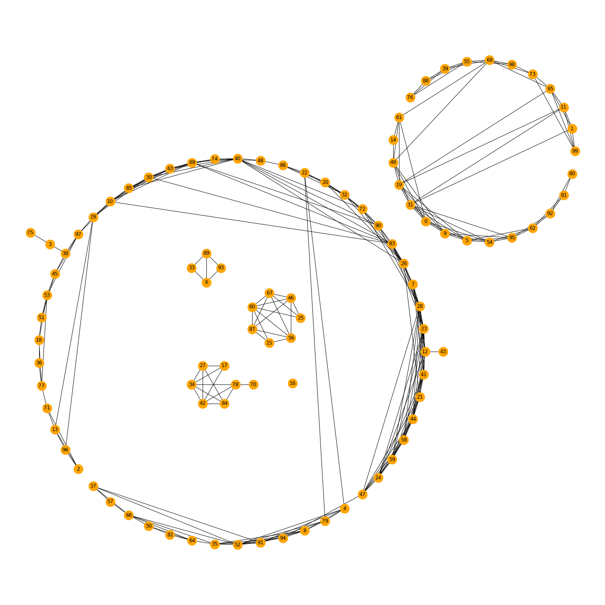
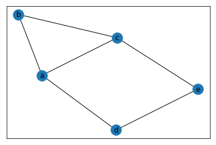
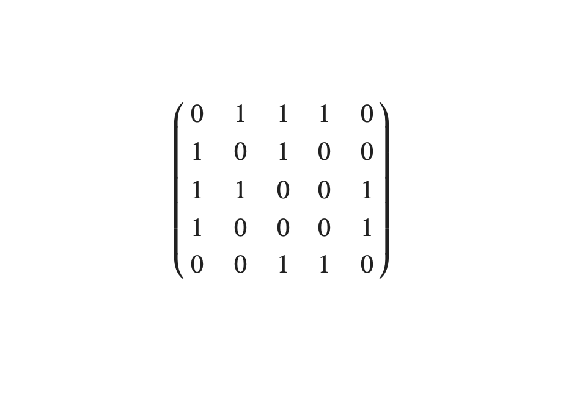
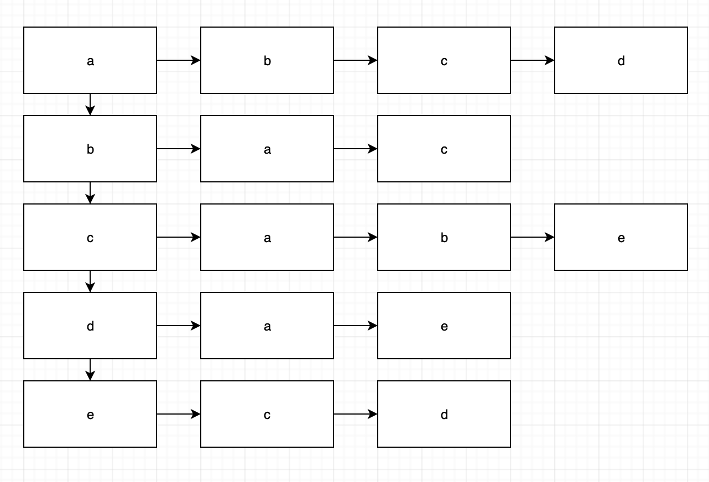
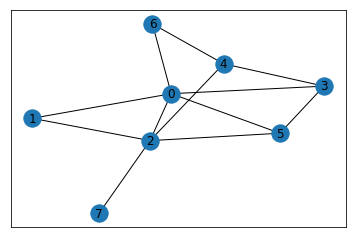

<p align="right"><sup><a href="README.md">Tartalom</a></sup></p>

# Gráfok kezelése Pythonban

Ebben a cikkben gráfokkal kapcsolatos közismert gráfbejárási algoritmusok példaimplementációiról lesz szó. A cikkben bemutatott algoritmusokhoz használt Jupyter Notebook elérhető az alábbi linken:

https://github.com/nlharri/Pythonarium/blob/master/SourceCode/GraphAlgorithms/GraphAlgorithms1.ipynb

A cikkhez a következő Python package-eket fogom használni:
- `networkx`: komplex hálózatok struktúrájának, dinamikájának a tanulmányozására szolgáló csomag. Gráfok létrehozására és ábrázolására fogom használni.
- `numpy`: tudományos számítások végzésére használható csomag. A `networx` csomag gráf objektumának adjacencia mátrixát vissza lehet kérni a `numpy` mátrix formátumában. Emiatt fogom használni.
- `matplotlib`: 2D rajzoló csomag. A gráfok megjelenítéséhez fogom használni a `networx`-szel együtt.



A networkx csomaggal a fentihez hasonló gráfokat lehet megjeleníteni. Pl. a fenti gráfot az alábbi programmal lehet megjeleníteni, Jupyter Notebook-ban vagy Google Colab környezetben.

```python
import matplotlib.pyplot as plt
import networkx as nx

G = nx.random_geometric_graph(100, 0.125)
pos = graphviz_layout(G, prog='circo')
plt.figure(figsize=(20, 20))
nx.draw(G, pos, node_size=500, alpha=1, node_color="orange", with_labels=True)
plt.axis('equal')
plt.show()
```

# Mik a gráfok?

A gráf formális definíciója egy *G(V,E)* pár, ahol *V* a csúcsok véges halmaza, *E* pedig az élek halmaza. Egy él két csúcsból alkotott rendezetlen vagy rendezett pár. Egy gráf élei lehetnek irányítottak vagy irányítatlanok, lehetnek súlyozottak vagy súlyozatlanok. Tehát megkülönböztetjük az alábbiakat:
- irányítatlan, súlyozatlan gráfok
- irányított, súlyozatlan gráfok
- irányítatlan, súlyozott gráfok
- irányított, súlyozott gráfok

A súlyozatlan gráfokat elképzelhetjük úgy, mint a súlyozott gráfok speciális esetét, amikor minden súly 1. Az irányítatlan gráfokat pedig elképzelhetjük úgy, mint az irányított gráfok speciális esetét, amikor minden él mindkét irányban járható.

Amennyiben egy él mindkét végpontja ugyanaz a csúcs, akkor hurokélről beszélünk.

# Gráfok tárolása

Rögtön adódik a kérdés, hogy hogyan érdemes tárolni, ábrázolni egy gráfot. Két általánosan elterjedt ábrázolási módot ismertetek, a szomszédsági mátrixot és az éllistás ábrázolást.

## Szomszédsági mátrix

Vegyük példaként az alábbi, irányítatlan, súlyozatlan gráfot.



A szomszédsági mátrix (adjacencia mátrix, csúcsmátrix) egy olyan, számokból álló táblázat, amelynek annyi sora és oszlopa van, ahány csúcsa van a gráfnak. A példánkban használt gráfnak 5 csúcsa van, ezért a mátrix 5x5-ös. A mátrix i. sorának j. oszlopában szerepel annak az élnek a súlya, amelyik az i. csúcsból a j. csúcsba megy. Ha nincs él az i.-ből a j. csúcsba, akkor a *végtelen* értéket kell használnunk a mátrix elemeként. Súlyozatlan gráfoknál minden elem 0 vagy 1 értékű. Irányítatlan gráfoknál a mátrix szimmetrikus.

A továbbiakban egyszerű gráfokkal dolgozunk, amelyek nem tartalmaznak sem hurokéleket, sem többszörös éleket. Így a mátrix főátlójában mindig 0-k szerepelnek. 

A fenti gráfnak a szomszédsági mátrixa a következőképpen néz ki:



## Éllistás ábrázolás

Ebben az esetben a gráf csúcsai egy listában tároljuk. A lista minden eleméhez hozzárendelünk egy-egy listát: a csúcsból induló élek listáját.

A csúcshoz rendelt lista elemeiben a csúcsból kiinduló élek célcsúcsainak azonosítóját tároljuk. Irányítatlan esetben a célcsúcshoz tartozó listában is eltároljuk az él másik végpontját. Súlyozott esetben a célcsúcsot tartalmazó listaelem tartalmazni fogja az él súlyát is.

A fenti gráf éllistás ánrázolása a következő:



# Gráfok kezelése Pythonban

A Pythonban a gráfok kezelése ebben a cikkben a `networkx` csomagot fogom használni. Ez a csomag összetett hálózatok létrehozását, manipulálását, tanulmányozását teszi lehetővé.

A `networkx` használatához telepíteni kell azt a `pip` segítségével:

```
pip install networkx --upgrade
```

## Gráfok megjelenítése

Az alábbi program a fent vázolt gráfot definiálja majd megjeleníti a `networkx` csomag használatával:

```python
import networkx as nx

G=nx.Graph()
G.add_nodes_from(["a", "b", "c", "d", "e"])
G.add_edges_from([("a", "b"), 
                  ("b", "c"), 
                  ("c", "a"), 
                  ("a", "d"), 
                  ("c", "e"), 
                  ("d", "e")])

nx.draw_networkx(G)
```

## Gráfok él- és csúcsszámának lekérdezése

```python
print("Nodes of graph: {}".format(G.nodes()))
print("Edges of graph: {}".format(G.edges()))
```

```
Nodes of graph: ['a', 'b', 'c', 'd', 'e']
Edges of graph: [('a', 'b'), ('a', 'c'), ('a', 'd'), ('b', 'c'), ('c', 'e'), ('d', 'e')]
```

## Gráfok adjacenciamátrixának elérése

Az adjacenciamátrixot a `to_numpy_matrix()` függvénnyel lehet elérni. (További lehetőségekről a referencia dokumentáció ad tájékoztatást.)

```python
m = nx.to_numpy_matrix(G)
print(m)
```

```
[[0. 1. 1. 1. 0.]
 [1. 0. 1. 0. 0.]
 [1. 1. 0. 0. 1.]
 [1. 0. 0. 0. 1.]
 [0. 0. 1. 1. 0.]]
```

Az alább ismertetett algoritmusoknál az adjacenciamátrixot fogom használni a gráf elérésére. Az algoritmusokat a Google Colab rendszerben implementáltam.

A szélességi és mélységi bejáráshoz a következő gráfot fogom használni:



# Gráfbejárás mélységi kereséssel

A mélységi bejárás algoritmusát itt is a `depth_first_search()` függvény tartalmazza. A mélységi bejárás lényege, hogy egy adott csúcsból kiindulva először a csúcs első szomszédját látogatom meg, és már az első szomszéd meglátogatásakor meglátogatom ennek is az első szomszédját. Csak akkor lépek tovább a következő szomszéd meglátogatására, amikor az előző szomszéd minden szomszédja (és azoknak is minden szomszédja) meg lett látogatva. Így a bejárás során hamar a gráf mélyére jutok, a legtávolabbi csúcshoz.

Az alábbi programban figyelemmel kísérjük a meglátogatott csúcsokat (`visited_vertices`).

```python
import networkx as nx
import numpy as np

from networkx.drawing.nx_pydot import graphviz_layout
import matplotlib.pyplot as plt

def depth_first_search(v, m, visited_vertices, depth):
    padding = "  "
    if v not in visited_vertices:
        print("{}visiting {}".format(padding*depth, v))
        visited_vertices.append(v)
        num_of_vertices = np.shape(m)[0]
        print("{}visiting neighbours of {}".format(padding*depth, v))
        for j in range(0, num_of_vertices):
            if m[v,j] != 0:
                print("{}stepping to edge ({}, {})".format(padding*depth, v, j))
                depth_first_search(j, m, visited_vertices, depth + 1)
    else:
        print("{}{} was already visited".format(padding*depth, v))


G=nx.Graph()
G.add_nodes_from(["0", "1", "2", "3", "4", "5", "6", "7"])
G.add_edges_from([("0", "1"), 
                  ("1", "2"), 
                  ("2", "0"), 
                  ("0", "3"), 
                  ("2", "4"), 
                  ("3", "4"), 
                  ("0", "6"), 
                  ("4", "6"), 
                  ("2", "5"), 
                  ("3", "5"), 
                  ("0", "5"), 
                  ("2", "7")])

pos = graphviz_layout(G, prog='neato')
plt.figure(figsize=(10, 10))
nx.draw(G, pos, node_size=500, alpha=1, node_color="orange", with_labels=True)
plt.axis('equal')
plt.show()

print("Nodes of graph: {}".format(G.nodes()))
print("Edges of graph: {}".format(G.edges()))
visited_vertices = []
depth_first_search(0, nx.to_numpy_matrix(G), visited_vertices, 0)
print("Vertices were visited in the following sequence: {}".format(visited_vertices))
```

A program a kimenetre kiírja a csúcsok meglátogatásának sorrendjét.

```
Nodes of graph: ['0', '1', '2', '3', '4', '5', '6', '7']
Edges of graph: [('0', '1'), ('0', '2'), ('0', '3'), ('0', '6'), ('0', '5'), ('1', '2'), ('2', '4'), ('2', '5'), ('2', '7'), ('3', '4'), ('3', '5'), ('4', '6')]
visiting 0
visiting neighbours of 0
stepping to edge (0, 1)
  visiting 1
  visiting neighbours of 1
  stepping to edge (1, 0)
    0 was already visited
  stepping to edge (1, 2)
    visiting 2
    visiting neighbours of 2
    stepping to edge (2, 0)
      0 was already visited
    stepping to edge (2, 1)
      1 was already visited
    stepping to edge (2, 4)
      visiting 4
      visiting neighbours of 4
      stepping to edge (4, 2)
        2 was already visited
      stepping to edge (4, 3)
        visiting 3
        visiting neighbours of 3
        stepping to edge (3, 0)
          0 was already visited
        stepping to edge (3, 4)
          4 was already visited
        stepping to edge (3, 5)
          visiting 5
          visiting neighbours of 5
          stepping to edge (5, 0)
            0 was already visited
          stepping to edge (5, 2)
            2 was already visited
          stepping to edge (5, 3)
            3 was already visited
      stepping to edge (4, 6)
        visiting 6
        visiting neighbours of 6
        stepping to edge (6, 0)
          0 was already visited
        stepping to edge (6, 4)
          4 was already visited
    stepping to edge (2, 5)
      5 was already visited
    stepping to edge (2, 7)
      visiting 7
      visiting neighbours of 7
      stepping to edge (7, 2)
        2 was already visited
stepping to edge (0, 2)
  2 was already visited
stepping to edge (0, 3)
  3 was already visited
stepping to edge (0, 5)
  5 was already visited
stepping to edge (0, 6)
  6 was already visited
Vertices were visited in the following sequence: [0, 1, 2, 4, 3, 5, 6, 7]
```

# Gráfbejárás szélességi kereséssel

A szélességi bejárás algoritmusát a `breadth_first_search()` függvény tartalmazza. A szélességi bejárás lényege, hogy egy adott csúcsból kiindulva először a csúcs szomszédait látogatom meg. Majd veszem az első, második, stb. szomszédját, és újra ugyanígy járok el. Így a látogatások egyre távolabb kerülnek a kiinduló csúcstól, de közben az adott távolságig az összes csúcsot meglátogatom.

Az alábbi programban figyelemmel kísérjük a meglátogatott csúcsokat (`visited_vertices`).

```python
import networkx as nx
import numpy as np

from networkx.drawing.nx_pydot import graphviz_layout
import matplotlib.pyplot as plt

def mark_as_visited(v, m, visited_vertices, to_be_visited_vertices):
    if v not in visited_vertices:
        print("visiting {}".format(v))
        visited_vertices.append(v)
        num_of_vertices = np.shape(m)[0]
        for j in range(0, num_of_vertices):
            if m[v,j] != 0 and j not in visited_vertices:
                to_be_visited_vertices.append(j)
    else:
        print("{} was already visited".format(v))

def breadth_first_search(v, m, visited_vertices):
    to_be_visited_vertices = []
    mark_as_visited(v, m, visited_vertices, to_be_visited_vertices)
    while len(to_be_visited_vertices) != 0:
        j = to_be_visited_vertices.pop(0)
        mark_as_visited(j, m, visited_vertices, to_be_visited_vertices)


G=nx.Graph()
G.add_nodes_from(["0", "1", "2", "3", "4", "5", "6", "7"])
G.add_edges_from([("0", "1"), 
                  ("1", "2"), 
                  ("2", "0"), 
                  ("0", "3"), 
                  ("2", "4"), 
                  ("3", "4"), 
                  ("0", "6"), 
                  ("4", "6"), 
                  ("2", "5"), 
                  ("3", "5"), 
                  ("0", "5"), 
                  ("2", "7")])

pos = graphviz_layout(G, prog='neato')
plt.figure(figsize=(10, 10))
nx.draw(G, pos, node_size=500, alpha=1, node_color="orange", with_labels=True)
plt.axis('equal')
plt.show()

print("Nodes of graph: {}".format(G.nodes()))
print("Edges of graph: {}".format(G.edges()))
visited_vertices = []
breadth_first_search(0, nx.to_numpy_matrix(G), visited_vertices)
print("Vertices were visited in the following sequence: {}".format(visited_vertices))
```

Ennek a programnak a kimenete a következő:

```
Nodes of graph: ['0', '1', '2', '3', '4', '5', '6', '7']
Edges of graph: [('0', '1'), ('0', '2'), ('0', '3'), ('0', '6'), ('0', '5'), ('1', '2'), ('2', '4'), ('2', '5'), ('2', '7'), ('3', '4'), ('3', '5'), ('4', '6')]
visiting 0
visiting 1
visiting 2
visiting 3
visiting 5
visiting 6
2 was already visited
visiting 4
5 was already visited
visiting 7
4 was already visited
5 was already visited
4 was already visited
Vertices were visited in the following sequence: [0, 1, 2, 3, 5, 6, 4, 7]
```

Ha megnézzük a csúcsok meglátogatásának a sorrendjét (`[0, 1, 2, 3, 5, 6, 4, 7]`) és a gráfot a képen, akkor látható, hogy valóban először egy mélységig megyünk a gráfban, majd 2 mélységig, és így tovább. Egy "mélyebb" gráffal ez még jobban látszik. Az alábbi kód egy másik gráfot hoz létre, ami alatta látható. (A gráfbejáró algoritmus ugyanaz, mint előbb.)

```python
import networkx as nx
import numpy as np
from networkx.drawing.nx_pydot import graphviz_layout
import matplotlib.pyplot as plt

def mark_as_visited(v, m, visited_vertices, to_be_visited_vertices):
    if v not in visited_vertices:
        print("visiting {}".format(v))
        visited_vertices.append(v)
        num_of_vertices = np.shape(m)[0]
        for j in range(0, num_of_vertices):
            if m[v,j] != 0 and j not in visited_vertices:
                to_be_visited_vertices.append(j)
    else:
        print("{} was already visited".format(v))

def breadth_first_search(v, m, visited_vertices):
    to_be_visited_vertices = []
    mark_as_visited(v, m, visited_vertices, to_be_visited_vertices)
    while len(to_be_visited_vertices) != 0:
        j = to_be_visited_vertices.pop(0)
        mark_as_visited(j, m, visited_vertices, to_be_visited_vertices)


G=nx.Graph()
G.add_nodes_from(["0", "1", "2", "3", "4", "5", "6", "7", "8", "9", "10", "11"])
G.add_edges_from([("0", "1"), 
                  ("1", "2"), 
                  ("2", "0"), 
                  ("0", "3"), 
                  ("2", "4"), 
                  ("3", "4"), 
                  ("0", "6"), 
                  ("4", "6"), 
                  ("2", "5"), 
                  ("3", "5"), 
                  ("0", "5"), 
                  ("2", "7"),
                  ("7", "8"),
                  ("8", "2"),
                  ("8", "3"),
                  ("8", "4"),
                  ("8", "5"),
                  ("8", "6"),
                  ("8", "9"),
                  ("8", "10"),
                  ("8", "11"),
                  ("10", "11")])

pos = graphviz_layout(G, prog='twopi')
plt.figure(figsize=(10, 10))
nx.draw(G, pos, node_size=500, alpha=1, node_color="orange", with_labels=True)
plt.axis('equal')
plt.show()

print("Nodes of graph: {}".format(G.nodes()))
print("Edges of graph: {}".format(G.edges()))
visited_vertices = []
breadth_first_search(0, nx.to_numpy_matrix(G), visited_vertices)
print("Vertices were visited in the following sequence: {}".format(visited_vertices))
```


A fenti algoritmust lefuttatva erre a gráfra az alábbi csúcs-sorrendet kapjuk.

```
[0, 1, 2, 3, 5, 6, 4, 7, 8, 9, 10, 11]
```

Mégegy érdekes példa, egy körkörösen ábrázolt fa:

```python
import matplotlib.pyplot as plt
import networkx as nx
from networkx.drawing.nx_pydot import graphviz_layout
import numpy as np

def mark_as_visited(v, m, visited_vertices, to_be_visited_vertices):
    print("visiting {}".format(v))
    visited_vertices.append(v)
    num_of_vertices = np.shape(m)[0]
    for j in range(0, num_of_vertices):
        if m[v,j] != 0 and j not in visited_vertices:
            to_be_visited_vertices.append(j)

def breadth_first_search(v, m, visited_vertices):
    to_be_visited_vertices = []
    mark_as_visited(v, m, visited_vertices, to_be_visited_vertices)
    while len(to_be_visited_vertices) != 0:
        j = to_be_visited_vertices.pop(0)
        mark_as_visited(j, m, visited_vertices, to_be_visited_vertices)

G = nx.balanced_tree(2, 3)
pos = graphviz_layout(G, prog='twopi')
plt.figure(figsize=(10, 10))
nx.draw(G, pos, node_size=500, alpha=1, node_color="orange", with_labels=True)
plt.axis('equal')
plt.show()

print("Nodes of graph: {}".format(G.nodes()))
print("Edges of graph: {}".format(G.edges()))
visited_vertices = []
breadth_first_search(0, nx.to_numpy_matrix(G), visited_vertices)
print("Vertices were visited in the following sequence: {}".format(visited_vertices))
```


Erre a `G` gráfra lefuttatva a bejárást, az eredmény a következő:

```
Nodes of graph: [0, 1, 2, 3, 4, 5, 6, 7, 8, 9, 10, 11, 12, 13, 14]
Edges of graph: [(0, 1), (0, 2), (1, 3), (1, 4), (2, 5), (2, 6), (3, 7), (3, 8), (4, 9), (4, 10), (5, 11), (5, 12), (6, 13), (6, 14)]
visiting 0
visiting 1
visiting 2
visiting 3
visiting 4
visiting 5
visiting 6
visiting 7
visiting 8
visiting 9
visiting 10
visiting 11
visiting 12
visiting 13
visiting 14
Vertices were visited in the following sequence: [0, 1, 2, 3, 4, 5, 6, 7, 8, 9, 10, 11, 12, 13, 14]
```

# Referenciák

- [Gráf](https://hu.wikipedia.org/wiki/Gráf)
- [Benjamin Baka: Python Data Structures and Algorithms](https://www.amazon.com/Python-Data-Structures-Algorithms-application-ebook/dp/B01IF7NLM8)
- [Algoritmusok és adatszerkezetek / Gráfok ábrázolása](http://tamop412.elte.hu/tananyagok/algoritmusok/lecke23_lap1.html)
- [networx](https://networkx.github.io)
- [Graphviz - Graph Visualization Software](https://graphviz.gitlab.io/documentation/)
- [numpy](https://numpy.org)
- [Matplotlib](https://matplotlib.org)
- [networkx 2.3 at pypi](https://pypi.org/project/networkx/2.3/)
- [NetworkX Reference Release 2.3](https://networkx.github.io/documentation/stable/_downloads/networkx_reference.pdf)

<p align="right"><sup><a href="README.md">Tartalom</a></sup></p>
